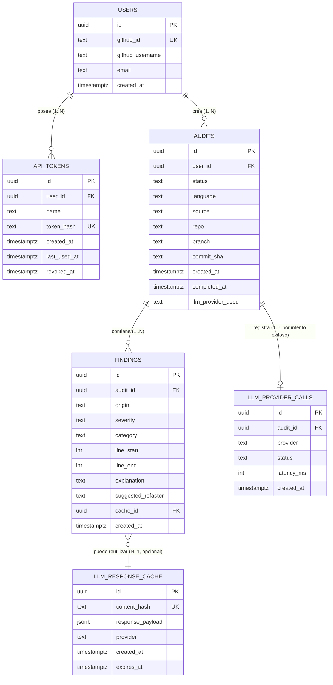

# CodeAudit AI — DB_model.md

**Motor:** PostgreSQL (Neon) · **Versión del modelo:** 1.0

---

## 1. Diagrama entidad-relación (vista lógica)



## 2. Tablas, atributos y relaciones

### 2.1 `users`

| Atributo | Tipo | Restricciones |
|---|---|---|
| `id` | `uuid` | PK, `default gen_random_uuid()` |
| `github_id` | `text` | `UNIQUE, NOT NULL` — identificador estable de GitHub OAuth |
| `github_username` | `text` | `NOT NULL` |
| `email` | `text` | `NOT NULL` |
| `created_at` | `timestamptz` | `NOT NULL, default now()` |

**Relación:** `users (1) → (N) api_tokens` y `users (1) → (N) audits`. Dirección: un usuario posee/crea muchos registros; cada token/auditoría pertenece exactamente a un usuario (multiplicidad `1..N` desde `users`, `N..1` desde las tablas hijas).

### 2.2 `api_tokens`

| Atributo | Tipo | Restricciones |
|---|---|---|
| `id` | `uuid` | PK |
| `user_id` | `uuid` | FK → `users.id`, `ON DELETE CASCADE`, `NOT NULL` |
| `name` | `text` | `NOT NULL` — etiqueta legible (ej. "laptop-personal") |
| `token_hash` | `text` | `UNIQUE, NOT NULL` — SHA-256 del token; **nunca se guarda el valor en claro** |
| `created_at` | `timestamptz` | `NOT NULL, default now()` |
| `last_used_at` | `timestamptz` | Nullable — se actualiza en cada request autenticado con este token |
| `revoked_at` | `timestamptz` | Nullable — `NULL` = token activo |

### 2.3 `audits`

| Atributo | Tipo | Restricciones |
|---|---|---|
| `id` | `uuid` | PK |
| `user_id` | `uuid` | FK → `users.id`, `ON DELETE CASCADE`, `NOT NULL` |
| `status` | `text` | `NOT NULL`, `CHECK (status IN ('pending','processing','completed','failed'))` |
| `language` | `text` | `NOT NULL`, `CHECK (language IN ('go','javascript','typescript'))` |
| `source` | `text` | `NOT NULL` — `'cli'` o `'web'` |
| `repo` | `text` | Nullable — contexto opcional del PR |
| `branch` | `text` | Nullable |
| `commit_sha` | `text` | Nullable |
| `created_at` | `timestamptz` | `NOT NULL, default now()` |
| `completed_at` | `timestamptz` | Nullable |
| `llm_provider_used` | `text` | Nullable — `'groq'` o `'gemini'`, se llena al completar |

**Relación:** `audits (1) → (N) findings` — una auditoría agrupa todos sus hallazgos, tanto estáticos como de LLM. `audits (1) → (0..N) llm_provider_calls` — se registra cada intento (incluyendo los que fallaron y gatillaron el failover), no solo el exitoso.

### 2.4 `findings`

| Atributo | Tipo | Restricciones |
|---|---|---|
| `id` | `uuid` | PK |
| `audit_id` | `uuid` | FK → `audits.id`, `ON DELETE CASCADE`, `NOT NULL` |
| `origin` | `text` | `NOT NULL`, `CHECK (origin IN ('static','llm'))` |
| `severity` | `text` | `NOT NULL`, `CHECK (severity IN ('blocker','critical','major','minor','info'))` |
| `category` | `text` | `NOT NULL` — ej. `'high-cyclomatic-complexity'` |
| `line_start` | `int` | `NOT NULL` |
| `line_end` | `int` | `NOT NULL` |
| `explanation` | `text` | `NOT NULL` |
| `suggested_refactor` | `text` | Nullable — no todos los hallazgos estáticos traen sugerencia de refactor |
| `cache_id` | `uuid` | FK → `llm_response_cache.id`, Nullable — se llena solo si el hallazgo vino de una respuesta cacheada |
| `created_at` | `timestamptz` | `NOT NULL, default now()` |

### 2.5 `llm_provider_calls`

Tabla de trazabilidad/auditoría técnica (no confundir con `audits`, que es el objeto de negocio) — permite responder "¿cuántas veces falló Groq esta semana?" sin tener que parsear logs.

| Atributo | Tipo | Restricciones |
|---|---|---|
| `id` | `uuid` | PK |
| `audit_id` | `uuid` | FK → `audits.id`, `ON DELETE CASCADE`, `NOT NULL` |
| `provider` | `text` | `NOT NULL`, `CHECK (provider IN ('groq','gemini'))` |
| `status` | `text` | `NOT NULL`, `CHECK (status IN ('success','rate_limited','timeout','error'))` |
| `latency_ms` | `int` | Nullable |
| `created_at` | `timestamptz` | `NOT NULL, default now()` |

### 2.6 `llm_response_cache`

Implementa la estrategia de caché descrita en `Architecture.md` sección 4.

| Atributo | Tipo | Restricciones |
|---|---|---|
| `id` | `uuid` | PK |
| `content_hash` | `text` | `UNIQUE, NOT NULL` — `sha256(código_normalizado + versión_del_prompt)` |
| `response_payload` | `jsonb` | `NOT NULL` — respuesta cruda validada del LLM |
| `provider` | `text` | `NOT NULL` |
| `created_at` | `timestamptz` | `NOT NULL, default now()` |
| `expires_at` | `timestamptz` | `NOT NULL` — 30 días desde `created_at` |

**Relación:** `llm_response_cache (1) → (0..N) findings` — una misma entrada de caché puede haber servido de base a hallazgos de múltiples auditorías distintas (ej. el mismo archivo sin cambios entre dos PRs).

## 3. Estrategia de normalización

El modelo se diseña en **Tercera Forma Normal (3NF)**:

- **1NF:** todos los atributos son atómicos (ej. `severity` es un único valor controlado por `CHECK`, no una lista serializada de severidades).
- **2NF:** no hay dependencias parciales — todas las tablas usan `uuid` como PK simple, no hay PKs compuestas de las que depender parcialmente.
- **3NF:** no hay dependencias transitivas. Por ejemplo, `llm_provider_used` vive en `audits` (depende directamente de la auditoría), mientras que el detalle de cada intento individual (exitoso o no) vive en `llm_provider_calls`, evitando repetir esa información fila por fila dentro de `findings`.

**Excepción deliberada (desnormalización controlada):** `response_payload` en `llm_response_cache` se guarda como `jsonb` en vez de descomponerse en columnas o tablas adicionales. Es una decisión consciente: ese payload es un blob de solo lectura, cacheado por hash, que nunca se consulta por sus campos internos desde SQL — descomponerlo agregaría tablas sin ningún beneficio de integridad o consulta real.

## 4. Estrategias de rendimiento

### 4.1 Índices

| Índice | Tabla | Propósito |
|---|---|---|
| `idx_audits_user_created` en `(user_id, created_at DESC)` | `audits` | Acelera el listado paginado del historial por usuario (`GET /v1/audits`), que siempre ordena por fecha descendente |
| `idx_audits_status_pending` — índice parcial `WHERE status IN ('pending','processing')` | `audits` | El worker necesita encontrar rápidamente los jobs activos sin escanear auditorías ya completadas, que serán la mayoría con el tiempo |
| `idx_findings_audit_id` en `(audit_id)` | `findings` | Acelera la carga del detalle completo de una auditoría (`GET /v1/audits/{id}`) |
| `idx_api_tokens_hash` (implícito por `UNIQUE`) | `api_tokens` | Búsqueda O(1) del token en cada request autenticado — es el índice más "caliente" de todo el sistema, se consulta en cada llamada al API |
| `idx_llm_cache_hash` (implícito por `UNIQUE`) | `llm_response_cache` | Búsqueda de caché antes de cada llamada al LLM |

### 4.2 Vista materializada: `v_audit_summary`

Una vista (no materializada en v1, dado el bajo volumen esperado; candidata a materializarse si el dashboard empieza a sentir carga) que precalcula, por auditoría, el conteo de hallazgos por severidad — evita que el endpoint de listado (`GET /v1/audits`) tenga que hacer un `GROUP BY` sobre `findings` en cada request:

```sql
CREATE VIEW v_audit_summary AS
SELECT
  a.id AS audit_id,
  a.user_id,
  a.status,
  COUNT(f.id) FILTER (WHERE f.severity = 'blocker')  AS blocker_count,
  COUNT(f.id) FILTER (WHERE f.severity = 'critical') AS critical_count,
  COUNT(f.id) FILTER (WHERE f.severity = 'major')    AS major_count,
  COUNT(f.id) FILTER (WHERE f.severity = 'minor')    AS minor_count,
  COUNT(f.id) FILTER (WHERE f.severity = 'info')     AS info_count
FROM audits a
LEFT JOIN findings f ON f.audit_id = a.id
GROUP BY a.id, a.user_id, a.status;
```

### 4.3 Trigger: `updated_at`/`last_used_at` automáticos

Un trigger genérico `set_last_used_at()` actualiza `api_tokens.last_used_at` en cada autenticación exitosa, ejecutado desde la capa `store` del backend (no desde SQL puro en cada request), para no acoplar la lógica de negocio de "qué cuenta como uso" a la base de datos. Se documenta aquí porque el campo existe en el modelo, aunque su actualización vive en código de aplicación por decisión de diseño (mantener la base de datos "tonta" y la lógica en la capa de dominio, coherente con `API_Contract.md` sección 6).

### 4.4 Política de retención (soporta FR-AUD-10)

Un job programado (GitHub Action con `schedule`, gratuito) ejecuta periódicamente:

```sql
DELETE FROM audits
WHERE created_at < now() - interval '90 days'
  AND status = 'completed';
```

Gracias a `ON DELETE CASCADE` en `findings` y `llm_provider_calls`, esta única sentencia libera espacio en las tres tablas relacionadas sin necesidad de borrados manuales adicionales — relevante dado el límite de 0.5 GB de almacenamiento del tier gratuito de Neon (ver `Architecture.md` sección 6.1).
